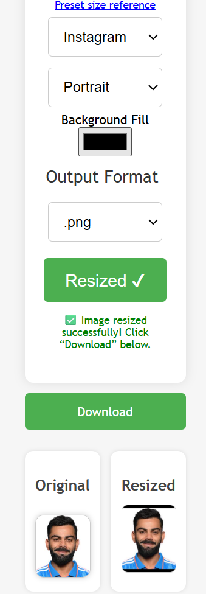

# 🖼️ ResizeMate – Social Media Image Resizer Chrome Extension

ResizeMate is a smart and user-friendly Chrome extension designed to help you **resize and format images** to fit platform-specific dimensions for social media. Whether you're posting a profile photo on Instagram or a banner on LinkedIn, ResizeMate makes it effortless with **1-click export**, **custom sizes**, and **real-time side-by-side preview**.

---

## 🚀 Features

- 🎯 Resize images for **4+ major platforms**: Facebook, Instagram, Twitter, LinkedIn
- 🧩 Supports **15+ output formats** including `.jpg`, `.png`, `.webp`, `.svg`, `.gif`, `.tiff`, `.ico`, and more
- 🔄 **Maintain aspect ratio** with centered alignment and background fill
- 🎨 Choose your **own background color** for padding
- 📐 Switch between **predefined sizes** (Profile, Cover, Story, etc.) or enter **custom width & height**
- 🔍 **Side-by-side preview** of original and resized images
- ⚡ Instant **in-browser resizing** using Canvas API (no upload required)
- 🖱️ Resize & download in just **3 clicks**
- 🧠 Intelligent preset auto-fill on platform change

---

## 📦 Installation

1. Download or clone this repository.
2. Open Google Chrome and go to: `chrome://extensions/`
3. Toggle **Developer mode** on (top-right corner).
4. Click **"Load unpacked"** and select the folder containing this project.
5. You’ll see the ResizeMate icon appear in your Chrome toolbar.

---

## 🎨 How to Use

1. Click the ResizeMate icon in the Chrome toolbar.
2. Upload your image via **Choose Image** button.
3. Select a platform (e.g. Instagram, Twitter).
4. Choose a preset (e.g. Profile Photo, Story) or switch to **Custom** to set your own width/height.
5. Select your desired background fill color and output format.
6. Click **Resize**.
7. Preview your image **side-by-side** with the original.
8. Hit **Download** to save the resized image.

---

## 📸 Screenshots

| Upload & Resize | Side-by-Side Preview |
|-----------------|----------------------|
|  |  |

---

## 🛠 Built With

- **HTML5** – Structure & layout
- **CSS3** – Flexbox & Grid for responsive UI
- **JavaScript** – FileReader, Canvas API, and Chrome Extension APIs

---

## 📁 File Highlights

| File | Purpose |
|------|---------|
| `popup.html` | Main UI for uploading, resizing, and preview |
| `popup.js` | JavaScript logic for presets, canvas rendering, dynamic preview |
| `styles.css` | UI styling including responsiveness and accessibility |
| `manifest.json` | Extension configuration and metadata |
| `resizemate-logo-*.png` | App icons |
| `resize-reference-guide.png` | Optional size reference chart for social media |
| `screenshots/` | Images for README documentation |

---

## 📂 Directory Structure

```
ResizeMate/
├── popup.html
├── popup.js
├── styles.css
├── manifest.json
├── resize-reference-guide.png
├── icons/
│   ├── resizemate-logo-16x16.png
│   ├── resizemate-logo-48x48.png
│   └── resizemate-logo-128x128.png
└── screenshots/
    ├── upload-interface.png
    └── preview-comparison.png
```

---

## 💡 Tip

If you want to regenerate icon sizes from a single image, you can use a tool like [favicon.io](https://favicon.io) or run a quick script using ImageMagick:

```bash
magick input.png -resize 16x16 icon16.png
magick input.png -resize 48x48 icon48.png
magick input.png -resize 128x128 icon128.png
```

---
